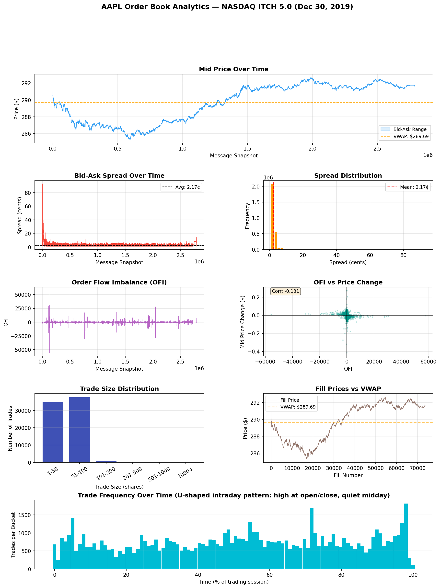

# Low-Latency Limit Order Book Engine

A limit order book engine written in C++17 that parses real NASDAQ binary market data, matches orders with nanosecond-level performance, and computes market microstructure analytics.

## What I Built

A limit order book is the core data structure of every electronic exchange. It keeps track of all buy and sell orders and matches them when prices cross. This project builds one from scratch and feeds it real NASDAQ data.

The engine parses raw binary messages from a NASDAQ ITCH 5.0 feed, reconstructs the full order book for AAPL, generates fills when orders match, and measures how fast each operation takes down to the nanosecond.

## Results

I ran the engine on the full NASDAQ feed from December 30, 2019, 8.25GB of raw binary data containing every order event across all stocks on NASDAQ that day.

For AAPL specifically, the engine processed 268,744,780 total messages, handled 698,744 add orders, 114,360,997 deletes, and 21,639,067 order replacements. It reconstructed 73,725 real fills, every time a buy and sell order matched and a trade happened.

## How Fast Is It

I measured latency using rdtsc, which reads the CPU cycle counter directly and gives nanosecond-level precision. These numbers are on Windows without CPU pinning, on a pinned Linux core the numbers would be significantly lower.

Adding an order to the book takes 554ns on average, with a p50 of 491ns and p99 of 4930ns. The p99 spike is from OS scheduler interrupts which are unavoidable on Windows. Cancelling an order takes 171ns on average with a p50 of 150ns.

Throughput is 2.69 million orders per second.

The next optimization step is replacing std::map with an array-based price ladder, which would bring average insert latency under 100ns by eliminating pointer chasing and improving cache locality.

## Market Microstructure Analytics

After replaying the full ITCH file I extracted book snapshots every 500 AAPL messages and computed the following metrics in Python.

AAPL traded between $285.80 and $292.50 that day. The average bid-ask spread was 2.09 cents, which is typical for a liquid large-cap stock. The spread was widest at market open and tightened quickly as liquidity arrived.

Order flow imbalance measures the difference between buying and selling pressure at the top of the book. The correlation between OFI and subsequent price changes was -0.157, meaning when the bid queue grew relative to the ask queue, price slightly reversed, suggesting mean reversion at this timescale.

## How It Works

The engine has four main components.

The ITCH parser reads the raw binary file two bytes at a time. The first two bytes give the message length, then it reads that many bytes and decodes the message type. ITCH is big-endian so every multi-byte field needs byte swapping using bitwise shifts. Prices are stored as fixed-point integers and divided by 10000 to get the dollar value.

The order book stores bids in a descending map and asks in an ascending map so the best bid and best ask are always at the front. Each price level holds a FIFO queue of orders. When a new order arrives it checks if it crosses the opposite side, if a buy price is greater than or equal to the best ask, it matches. Matching consumes orders from the front of each level's queue until the incoming order is fully filled or no more crosses exist.

The replay engine reads the ITCH file message by message and routes each one to the right handler. Add orders go into the book. Deletes remove orders. Cancels reduce quantity. Replaces cancel the old order and add a new one. Every 500 AAPL messages it snapshots the best bid, best ask, spread, mid price, and top-of-book quantities into a CSV file.

The benchmark measures addOrder and cancelOrder latency over 100,000 samples each. It detects CPU frequency by comparing rdtsc cycles to a wall-clock measurement, then uses that to convert cycles to nanoseconds.

## Project Structure

    lob-engine/
    ├── src/
    │   ├── OrderBook.hpp/.cpp       core matching engine
    │   ├── ITCHParser.hpp/.cpp      NASDAQ ITCH 5.0 binary parser
    │   ├── Replay.hpp/.cpp          market data replay engine
    │   └── main.cpp                 entry point
    ├── bench/
    │   └── benchmark.cpp            rdtsc latency benchmarks
    ├── analysis/
    │   ├── analyze.py               Python microstructure analytics
    │   └── aapl_analytics.png       output charts
    ├── data/                        ITCH data files (not committed)
    └── CMakeLists.txt

## How to Build

You need g++ 11 or later and CMake 3.14 or later. Clone the repo, create a build folder, run cmake pointing at your MinGW compiler, then run cmake --build.

## How to Run

To replay an ITCH file, run lob.exe with the path to your ITCH file and the stock symbol you want. For example: lob.exe data/12302019.NASDAQ_ITCH50 AAPL

To run the latency benchmarks, run bench.exe from the build folder.

To generate the analytics charts, go to the analysis folder and run analyze.py with Python.

## Data

NASDAQ ITCH 5.0 sample data is free to download at https://emi.nasdaq.com/ITCH/Nasdaq%20ITCH/
